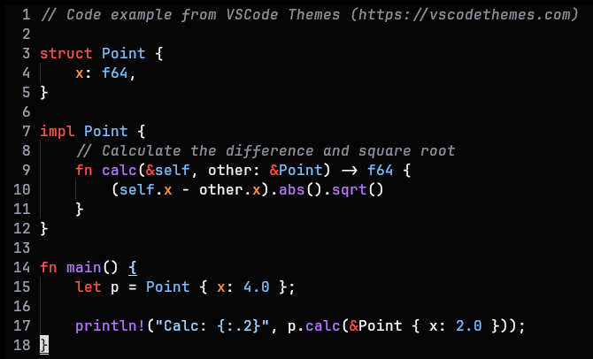

# github-dark-contrast-theme.nvim

High contrast, high saturation version of the dark github theme.



## How to use

with Lazy.nvim:

```lua
{
	"Peanutt42/github-dark-contrast-theme.nvim",
	lazy = false,
	priority = 1000,
	config = function()
		vim.cmd("colorscheme github_dark_contrast")
	end,
}
```

<br>

#### Attribution:

Ported from my custom Zed theme: <https://github.com/Peanutt42/zed-github-dark-contrast-theme>

which is a fork of: <https://github.com/mordfustang21/zed-github-dark>

which is a port from: <https://github.com/primer/github-vscode-theme>